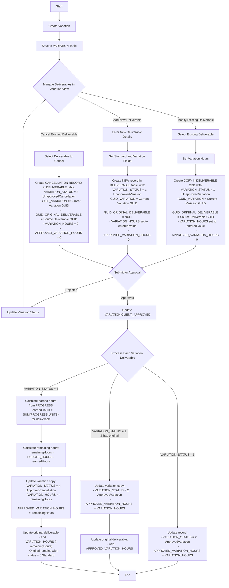

# FourSPM Variation Deliverables Implementation Guide

This document outlines the implementation of the Variation Deliverables feature in FourSPM, including database schema changes, backend API endpoints, and frontend components.

## 1. Database Schema Changes

### 1.1 DELIVERABLE Table Modifications

```sql
ALTER TABLE [dbo].[DELIVERABLE] 
ADD [VARIATION_STATUS] [int] NOT NULL DEFAULT 0,
    [GUID_VARIATION] [uniqueidentifier] NULL,
    [GUID_ORIGINAL_DELIVERABLE] [uniqueidentifier] NULL,
    [APPROVED_VARIATION_HOURS] [decimal](10, 2) NOT NULL DEFAULT 0;
```

### 1.2 Variation Status Values

- **0**: Standard deliverable (not from a variation)
- **1**: Unapproved variation deliverable
- **2**: Approved variation deliverable
- **3**: Unapproved cancelled deliverable
- **4**: Approved cancelled deliverable

## 2. Backend Implementation

### 2.1 C# Entity Model

```csharp
// Updated DELIVERABLE entity with variation fields
public class DELIVERABLE
{
    public Guid GUID { get; set; }
    public Guid GUID_PROJECT { get; set; }
    public string AREA_NUMBER { get; set; }
    public string DISCIPLINE { get; set; }
    public string DOCUMENT_TYPE { get; set; }
    public int? DEPARTMENT_ID { get; set; }
    public int DELIVERABLE_TYPE_ID { get; set; }
    public Guid? GUID_DELIVERABLE_GATE { get; set; }
    public string INTERNAL_DOCUMENT_NUMBER { get; set; }
    public string CLIENT_DOCUMENT_NUMBER { get; set; }
    public string DOCUMENT_TITLE { get; set; }
    public decimal BUDGET_HOURS { get; set; }
    public decimal VARIATION_HOURS { get; set; }
    public decimal APPROVED_VARIATION_HOURS { get; set; }
    public string BOOKING_CODE { get; set; }
    public decimal TOTAL_COST { get; set; }
    
    // Variation-specific fields
    public int VARIATION_STATUS { get; set; }
    public Guid? GUID_VARIATION { get; set; }
    public Guid? GUID_ORIGINAL_DELIVERABLE { get; set; }
    
    // Standard audit fields
    public DateTime CREATED { get; set; }
    public Guid CREATEDBY { get; set; }
    public DateTime? UPDATED { get; set; }
    public Guid? UPDATEDBY { get; set; }
    public DateTime? DELETED { get; set; }
    public Guid? DELETEDBY { get; set; }

    // Navigation properties
    public virtual PROJECT PROJECT { get; set; }
    public virtual DELIVERABLE_GATE DELIVERABLE_GATE { get; set; }
    public virtual VARIATION VARIATION { get; set; }
    public virtual DELIVERABLE ORIGINAL_DELIVERABLE { get; set; }
    public virtual ICollection<PROGRESS> PROGRESS { get; set; }
}

// Variation status enum
public enum VariationStatus
{
    Standard = 0,            // Regular deliverable (not from variation)
    UnapprovedVariation = 1, // Pending variation deliverable 
    ApprovedVariation = 2,   // Approved variation deliverable
    UnapprovedCancellation = 3, // Pending cancellation
    ApprovedCancellation = 4    // Approved cancellation
}
```

### 2.2 Extended Deliverable Repository Methods

```csharp
// Add these methods to the existing IDeliverableRepository interface
public interface IDeliverableRepository
{
    // Existing methods...
    
    // Variation-specific methods
    Task<IEnumerable<DELIVERABLE>> GetByVariationIdAsync(Guid variationId);
    Task<DELIVERABLE> GetVariationCopyAsync(Guid originalDeliverableId, Guid variationId);
    Task<DELIVERABLE> CreateVariationCopyAsync(DELIVERABLE deliverable, Guid originalDeliverableId, Guid variationId, int variationStatus);
    Task<DELIVERABLE> CreateNewVariationDeliverableAsync(DELIVERABLE deliverable, Guid variationId);
    Task<DELIVERABLE> CreateVariationCancellationAsync(Guid originalDeliverableId, Guid variationId);
}

// Implement these methods in DeliverableRepository
public async Task<IEnumerable<DELIVERABLE>> GetByVariationIdAsync(Guid variationId)
{
    return await _context.DELIVERABLEs
        .Where(d => d.GUID_VARIATION == variationId && d.DELETED == null)
        .ToListAsync();
}

public async Task<DELIVERABLE> GetVariationCopyAsync(Guid originalDeliverableId, Guid variationId)
{
    return await _context.DELIVERABLEs
        .FirstOrDefaultAsync(d => d.GUID_ORIGINAL_DELIVERABLE == originalDeliverableId && 
                             d.GUID_VARIATION == variationId && 
                             d.DELETED == null);
}

public async Task<DELIVERABLE> CreateVariationCopyAsync(DELIVERABLE original, Guid variationId, int variationStatus)
{
    // Create a copy of the deliverable with appropriate variation fields
    var copy = new DELIVERABLE
    {
        GUID = Guid.NewGuid(),
        GUID_PROJECT = original.GUID_PROJECT,
        AREA_NUMBER = original.AREA_NUMBER,
        DISCIPLINE = original.DISCIPLINE,
        DOCUMENT_TYPE = original.DOCUMENT_TYPE,
        DEPARTMENT_ID = original.DEPARTMENT_ID,
        DELIVERABLE_TYPE_ID = original.DELIVERABLE_TYPE_ID,
        GUID_DELIVERABLE_GATE = original.GUID_DELIVERABLE_GATE,
        INTERNAL_DOCUMENT_NUMBER = original.INTERNAL_DOCUMENT_NUMBER,
        CLIENT_DOCUMENT_NUMBER = original.CLIENT_DOCUMENT_NUMBER,
        DOCUMENT_TITLE = original.DOCUMENT_TITLE,
        BUDGET_HOURS = original.BUDGET_HOURS,
        VARIATION_HOURS = 0, // Will be set by caller
        APPROVED_VARIATION_HOURS = 0,
        BOOKING_CODE = original.BOOKING_CODE,
        TOTAL_COST = original.TOTAL_COST,
        
        // Variation-specific fields
        VARIATION_STATUS = variationStatus,
        GUID_VARIATION = variationId,
        GUID_ORIGINAL_DELIVERABLE = original.GUID,
        
        // Standard audit fields
        CREATED = DateTime.UtcNow,
        CREATEDBY = _userContext.CurrentUserId // Assuming you have access to the current user
    };
    
    _context.DELIVERABLEs.Add(copy);
    await _context.SaveChangesAsync();
    return copy;
}
```

### 2.3 API Endpoints

```csharp
/// <summary>
/// Gets all deliverables for a specific variation
/// </summary>
[HttpGet("odata/v1/Deliverables/ByVariation/{variationId}")]
public async Task<IActionResult> GetByVariation(Guid variationId)
{
    try
    {
        var deliverables = await _repository.GetByVariationIdAsync(variationId);
        return Ok(deliverables.Select(d => MapToEntity(d)));
    }
    catch (Exception ex)
    {
        _logger?.LogError(ex, "Error retrieving variation deliverables");
        return StatusCode(500, $"Error: {ex.Message}");
    }
}

/// <summary>
/// Adds or updates a variation copy of an existing deliverable
/// </summary>
[HttpPost("odata/v1/Deliverables/AddOrUpdateVariation")]
public async Task<IActionResult> AddOrUpdateVariation([FromBody] DeliverableVariationEntity entity)
{
    try
    {
        if (!ModelState.IsValid)
            return BadRequest(ModelState);

        _logger?.LogInformation($"Received AddOrUpdateVariation request for variation {entity.VariationGuid}, original deliverable {entity.OriginalDeliverableGuid}");

        // Get the original deliverable first
        var originalDeliverable = await _repository.GetByIdAsync(entity.OriginalDeliverableGuid);
        if (originalDeliverable == null)
            return NotFound($"Original deliverable with ID {entity.OriginalDeliverableGuid} not found");
            
        // Check if a variation copy already exists for this deliverable and variation
        var existingCopy = await _repository.GetVariationCopyAsync(
            entity.OriginalDeliverableGuid, 
            entity.VariationGuid);

        if (existingCopy != null)
        {
            // Update existing variation copy
            _logger?.LogInformation($"Updating existing variation copy {existingCopy.GUID}");

            // Only update variation-specific fields
            existingCopy.VARIATION_HOURS = entity.VariationHours;
            
            // Handle cancellation if needed
            if (entity.IsCancellation && existingCopy.VARIATION_STATUS != (int)VariationStatus.UnapprovedCancellation)
            {
                existingCopy.VARIATION_STATUS = (int)VariationStatus.UnapprovedCancellation;
            }

            var result = await _repository.UpdateAsync(existingCopy);
            return Ok(MapToEntity(result));
        }
        else
        {
            // Create new variation copy
            _logger?.LogInformation($"Creating new variation copy for deliverable {entity.OriginalDeliverableGuid}");
            
            int status = entity.IsCancellation ? 
                (int)VariationStatus.UnapprovedCancellation : 
                (int)VariationStatus.UnapprovedVariation;
                
            var newCopy = await _repository.CreateVariationCopyAsync(
                originalDeliverable,
                entity.VariationGuid, 
                status);
                
            // Set the variation hours
            newCopy.VARIATION_HOURS = entity.VariationHours;
            await _repository.UpdateAsync(newCopy);
                
            return Ok(MapToEntity(newCopy));
        }
    }
    catch (Exception ex)
    {
        _logger?.LogError(ex, "Error processing request");
        return StatusCode(500, $"Error: {ex.Message}");
    }
}

/// <summary>
/// Creates a new deliverable for a variation
/// </summary>
[HttpPost("odata/v1/Deliverables/CreateForVariation")]
public async Task<IActionResult> CreateForVariation([FromBody] DeliverableEntity entity)
{
    try
    {
        if (!ModelState.IsValid)
            return BadRequest(ModelState);

        _logger?.LogInformation($"Received CreateForVariation request for variation {entity.VariationGuid}");
        
        // Create domain model from entity
        var deliverable = new DELIVERABLE
        {
            GUID = Guid.NewGuid(),
            GUID_PROJECT = entity.ProjectGuid,
            AREA_NUMBER = entity.AreaNumber,
            DISCIPLINE = entity.Discipline,
            DOCUMENT_TYPE = entity.DocumentType,
            DEPARTMENT_ID = entity.DepartmentId,
            DELIVERABLE_TYPE_ID = entity.DeliverableTypeId,
            GUID_DELIVERABLE_GATE = entity.DeliverableGateGuid,
            INTERNAL_DOCUMENT_NUMBER = entity.InternalDocumentNumber,
            CLIENT_DOCUMENT_NUMBER = entity.ClientDocumentNumber,
            DOCUMENT_TITLE = entity.DocumentTitle,
            BUDGET_HOURS = entity.BudgetHours,
            VARIATION_HOURS = entity.VariationHours,
            APPROVED_VARIATION_HOURS = 0,
            BOOKING_CODE = entity.BookingCode,
            TOTAL_COST = entity.TotalCost,
            
            // Variation-specific fields
            VARIATION_STATUS = (int)VariationStatus.UnapprovedVariation,
            GUID_VARIATION = entity.VariationGuid,
            GUID_ORIGINAL_DELIVERABLE = null, // New deliverable, not a copy
            
            // Standard audit fields set by repository
        };
            
        var result = await _repository.CreateAsync(deliverable);
        return Created($"odata/v1/Deliverables/{result.GUID}", MapToEntity(result));
    }
    catch (Exception ex)
    {
        _logger?.LogError(ex, "Error processing request");
        return StatusCode(500, $"Error: {ex.Message}");
    }
}
```
```

### 2.4 Variation Approval Logic

```csharp
public async Task ApproveVariation(Guid variationId, Guid approvedBy)
{
    // Update variation
    var variation = await _variationRepository.GetByIdAsync(variationId);
    variation.CLIENT_APPROVED = DateTime.UtcNow;
    variation.CLIENT_APPROVEDBY = approvedBy;
    await _variationRepository.UpdateAsync(variation);
    
    // Update all associated variation deliverables
    var variationDeliverables = await _deliverableRepository.GetByVariationIdAsync(variationId);
    foreach (var deliverable in variationDeliverables)
    {
        // Handle standard variations
        if (deliverable.VARIATION_STATUS == (int)VariationStatus.UnapprovedVariation)
        {
            // Update to approved status
            deliverable.VARIATION_STATUS = (int)VariationStatus.ApprovedVariation;
            deliverable.APPROVED_VARIATION_HOURS = deliverable.VARIATION_HOURS;
            deliverable.UPDATED = DateTime.UtcNow;
            deliverable.UPDATEDBY = approvedBy;
            
            // If this is a variation copy of an existing deliverable, update the original
            if (deliverable.GUID_ORIGINAL_DELIVERABLE != null)
            {
                var original = await _deliverableRepository.GetByIdAsync(deliverable.GUID_ORIGINAL_DELIVERABLE.Value);
                if (original != null)
                {
                    // Add the variation hours to the original
                    original.VARIATION_HOURS += deliverable.VARIATION_HOURS;
                    original.UPDATED = DateTime.UtcNow;
                    original.UPDATEDBY = approvedBy;
                    await _deliverableRepository.UpdateAsync(original);
                }
            }
        }
        // Handle cancellations
        else if (deliverable.VARIATION_STATUS == (int)VariationStatus.UnapprovedCancellation)
        {
            // Get hours already earned for this deliverable
            var originalId = deliverable.GUID_ORIGINAL_DELIVERABLE ?? deliverable.GUID;
            var earnedHours = await _progressRepository.GetTotalUnitsAsync(originalId);
            var remainingHours = deliverable.BUDGET_HOURS - earnedHours;
            
            // Set negative hours to cancel remaining budget
            deliverable.VARIATION_HOURS = -remainingHours;
            deliverable.APPROVED_VARIATION_HOURS = -remainingHours;
            deliverable.VARIATION_STATUS = (int)VariationStatus.ApprovedCancellation;
            deliverable.UPDATED = DateTime.UtcNow;
            deliverable.UPDATEDBY = approvedBy;
            
            // Update the original deliverable if this is a copy
            if (deliverable.GUID_ORIGINAL_DELIVERABLE != null)
            {
                var original = await _deliverableRepository.GetByIdAsync(deliverable.GUID_ORIGINAL_DELIVERABLE.Value);
                if (original != null)
                {
                    // Add the negative variation hours to effectively cancel remaining budget
                    original.VARIATION_HOURS += -remainingHours;
                    original.UPDATED = DateTime.UtcNow;
                    original.UPDATEDBY = approvedBy;
                    await _deliverableRepository.UpdateAsync(original);
                }
            }
        }
        
        // Save the updated deliverable
        await _deliverableRepository.UpdateAsync(deliverable);
    }
}
```

## 3. Frontend Implementation

### 3.1 API Endpoints

```typescript
// In api-endpoints.ts
export const VARIATION_DELIVERABLES_ENDPOINT = 'odata/v1/VariationDeliverables';

export const getVariationDeliverablesQuery = (variationGuid: string) => 
  `${VARIATION_DELIVERABLES_ENDPOINT}?$filter=guidVariation eq ${variationGuid}&$expand=deliverable`;

export const getVariationDeliverablesUrl = (variationGuid: string, projectGuid: string) =>
  `${VARIATION_DELIVERABLES_ENDPOINT}?$filter=guidVariation eq ${variationGuid}`;
```

### 3.2 TypeScript Interface

```typescript
// In odata-types.ts
export interface VariationDeliverable {
  guid: string;
  variationGuid: string;
  deliverableGuid: string;
  hours: number;
  comments?: string;
  isNewDeliverable: boolean;
  isApproved: boolean;
  approvedDate?: string;
  approvedBy?: string;
  created: string;
  createdBy: string;
  updated?: string;
  updatedBy?: string;
  deleted?: string;
  deletedBy?: string;
  deliverable?: Deliverable;
}
```

### 3.3 Adapter Functions

```typescript
// In variation-deliverable.adapter.ts
import { ODataResponse } from '../types/odata-types';
import { sharedApiService } from '../services/shared-api-service';
import { VARIATION_DELIVERABLES_ENDPOINT } from '../config/api-endpoints';

export const addOrUpdateVariationDeliverable = async (
  variationGuid: string,
  deliverableGuid: string,
  data: {
    hours?: number;
    comments?: string;
    isNewDeliverable?: boolean;
  },
  token: string
): Promise<VariationDeliverable> => {
  const requestData = {
    guid: '', // Empty for auto-generation
    variationGuid,
    deliverableGuid,
    hours: data.hours || 0,
    comments: data.comments || '',
    isNewDeliverable: !!data.isNewDeliverable
  };

  const response = await sharedApiService.post<VariationDeliverable>(
    `${VARIATION_DELIVERABLES_ENDPOINT}/AddOrUpdateExisting`,
    requestData,
    token
  );
  
  return response.data;
};

export const getVariationDeliverableByIds = async (
  variationGuid: string,
  deliverableGuid: string,
  token: string
): Promise<VariationDeliverable | null> => {
  try {
    const filter = `guidVariation eq ${variationGuid} and guidDeliverable eq ${deliverableGuid}`;
    const query = `${VARIATION_DELIVERABLES_ENDPOINT}?$filter=${filter}`;
    const response = await sharedApiService.get<ODataResponse<VariationDeliverable>>(query, token);
    
    return response.data.value.length > 0 ? response.data.value[0] : null;
  } catch (error) {
    console.error('Error getting variation deliverable:', error);
    return null;
  }
};
```

### 3.4 Column Definitions

```typescript
// In variation-deliverable-columns.ts
export const createVariationDeliverableColumns = (props: any): ODataGridColumn[] => {
  return [
    {
      dataField: 'internalDocumentNumber',
      caption: 'Document Number',
      allowEditing: (options: any) => {
        // Allow editing only for variation-created deliverables
        return options.row.data.guidVariation === props.variationGuid;
      },
      hidingPriority: 2
    },
    {
      dataField: 'documentTitle',
      caption: 'Title',
      allowEditing: (options: any) => {
        // Allow editing only for variation-created deliverables
        return options.row.data.guidVariation === props.variationGuid;
      },
      hidingPriority: 3
    },
    // Other standard deliverable fields with the same pattern
    {
      dataField: 'variationHours',
      caption: 'Variation Hours',
      // Always editable for all rows
      allowEditing: true,
      dataType: 'number',
      editorOptions: {
        min: 0,
        showSpinButtons: true
      },
      hidingPriority: 4
    },
    {
      dataField: 'variationComments',
      caption: 'Comments',
      // Always editable for all rows
      allowEditing: true,
      hidingPriority: 5
    }
  ];
};
```

### 3.5 Custom Row Updating Handler

```typescript
const customHandleVariationRowUpdating = async (e: any) => {
  // Standard handlers should run first (validation)
  if (collectionHook.handleRowUpdating) {
    collectionHook.handleRowUpdating(e);
  }
  
  // Cancel the standard update since we're handling it manually
  e.cancel = true;
  
  // Create a modified update function that handles the API call and grid refresh
  const update = async () => {
    try {
      // Check if this is a deliverable created through variation or an existing one
      const isVariationDeliverable = e.oldData.guidVariation === variationGuid;
      
      // Only proceed if variation hours or comments have changed
      const hasVariationChanges = 
        (e.newData.variationHours !== undefined && e.newData.variationHours !== e.oldData.variationHours) ||
        (e.newData.variationComments !== undefined && e.newData.variationComments !== e.oldData.variationComments);
      
      if (hasVariationChanges) {
        if (isVariationDeliverable) {
          // This deliverable was created through the variation
          
          // 1. Update the deliverable table
          const deliverableUpdateData = {
            ...(e.newData.variationHours !== undefined && { variationHours: e.newData.variationHours }),
            ...(e.newData.variationComments !== undefined && { variationComments: e.newData.variationComments })
          };
          await updateDeliverable(e.key, deliverableUpdateData, token);
          
          // 2. ALSO update the variation deliverable record to maintain consistency
          await addOrUpdateVariationDeliverable(
            variationGuid,
            e.key,
            {
              hours: e.newData.variationHours || 0,
              comments: e.newData.variationComments || '',
              isNewDeliverable: true  // This is a variation-created deliverable
            },
            token
          );
        } else {
          // This is an existing deliverable - use AddOrUpdateExisting
          await addOrUpdateVariationDeliverable(
            variationGuid,
            e.key,
            {
              hours: e.newData.variationHours || 0,
              comments: e.newData.variationComments || '',
              isNewDeliverable: false
            },
            token
          );
        }
      } else if (isVariationDeliverable) {
        // Handle other field changes for variation deliverables
        await updateDeliverable(e.key, e.newData, token);
      }
      
      // Mark the grid as needing refresh after this edit
      if (e.component) {
        // Force the grid to refresh data from server
        setTimeout(() => {
          if (e.component.hasEditData()) {
            e.component.cancelEditData();
          }
          e.component.getDataSource().reload();
        }, 50);
      }
      
      return true;
    } catch (error) {
      console.error('Error updating variation deliverable:', error);
      
      if (e.component) {
        e.component.refresh();
      }
      
      return false;
    }
  };
  
  // Start the update process
  update();
};
```

### 3.6 Variation Deliverables Component

```typescript
// In variation-deliverables.tsx
import React, { useCallback, useRef } from 'react';
import { ODataGrid } from '../../components/odata-grid/odata-grid';
import { useAuth } from '../../hooks/useAuth';
import { getDeliverablesByVariationUrl } from '../../config/api-endpoints';
import { createVariationDeliverableColumns } from './variation-deliverable-columns';
import { useDeliverableCollectionController } from '../../hooks/controllers/useDeliverableCollectionController';
import { addOrUpdateVariationDeliverable, createNewVariationDeliverable } from '../../adapters/deliverable.adapter';

interface VariationDeliverablesProps {
  variationGuid: string;
  projectGuid: string;
}

export enum VariationStatus {
  Standard = 0,            // Regular deliverable (not from variation)
  UnapprovedVariation = 1, // Pending variation deliverable 
  ApprovedVariation = 2,   // Approved variation deliverable
  UnapprovedCancellation = 3, // Pending cancellation
  ApprovedCancellation = 4    // Approved cancellation
}

const VariationDeliverables: React.FC<VariationDeliverablesProps> = ({ variationGuid, projectGuid }) => {
  const { user } = useAuth();
  const gridRef = useRef<any>(null);
  const token = user?.token || '';
  
  // Get base controller hook
  const collectionHook = useDeliverableCollectionController(
    token,
    projectGuid,
    { /* standard config */ }
  );
  
  // Custom row updating handler
  const handleRowUpdating = useCallback(async (e: any) => {
    try {
      e.cancel = true; // Prevent default update behavior
      
      if (!e.newData || !e.oldData) {
        console.error('Missing data for update operation');
        return false;
      }

      // Merge the old data with the changes
      const updatedData = {
        ...e.oldData,
        ...e.newData
      };
      
      // Check if this is modifying an existing deliverable or creating a variation copy
      if (updatedData.guidOriginalDeliverable) {
        // This is a variation copy - update it
        await addOrUpdateVariationDeliverable(token, {
          guid: updatedData.guid,
          variationGuid: variationGuid,
          originalDeliverableGuid: updatedData.guidOriginalDeliverable,
          variationHours: updatedData.variationHours,
          isCancellation: updatedData.variationStatus === VariationStatus.UnapprovedCancellation
        });
      } else if (updatedData.guidVariation === variationGuid) {
        // This is a brand new deliverable created for this variation - update it completely
        await addOrUpdateVariationDeliverable(token, {
          guid: updatedData.guid,
          variationGuid: variationGuid,
          projectGuid: projectGuid,
          areaNumber: updatedData.areaNumber,
          discipline: updatedData.discipline,
          documentType: updatedData.documentType,
          departmentId: updatedData.departmentId,
          deliverableTypeId: updatedData.deliverableTypeId,
          deliverableGateGuid: updatedData.guidDeliverableGate,
          internalDocumentNumber: updatedData.internalDocumentNumber,
          clientDocumentNumber: updatedData.clientDocumentNumber,
          documentTitle: updatedData.documentTitle,
          budgetHours: updatedData.budgetHours,
          variationHours: updatedData.variationHours,
          bookingCode: updatedData.bookingCode || '',
          totalCost: updatedData.totalCost || 0
        });
      }
      
      // Refresh the grid to show the updated data
      if (e.component) {
        e.component.refresh();
      }
      
      return true;
    } catch (error) {
      console.error('Error updating variation deliverable:', error);
      
      if (e.component) {
        e.component.refresh();
      }
      
      return false;
    }
  }, [token, variationGuid, projectGuid]);
  
  // Custom row validating handler
  const onRowValidating = (e: any) => {
    // Validation for new variation deliverables
    if (e.newData.variationStatus === VariationStatus.UnapprovedVariation) {
      // Validate required fields for new deliverables
      if (!e.newData.documentTitle) {
        e.isValid = false;
        e.errorText = "Document Title is required";
      }
    }

    // Cancellation validation
    if (e.newData.variationStatus === VariationStatus.UnapprovedCancellation) {
      // No specific validation for cancellations currently
    }

    // For all variation types, ensure variation hours are valid
    if (e.newData.variationHours !== undefined) {
      if (e.newData.variationStatus === VariationStatus.UnapprovedCancellation) {
        // For cancellations, hours should be negative or zero
        if (e.newData.variationHours > 0) {
          e.isValid = false;
          e.errorText = "Cancellation hours should be negative or zero";
        }
      } else {
        // For regular variations, hours should be non-negative
        if (e.newData.variationHours < 0) {
          e.isValid = false;
          e.errorText = "Variation Hours cannot be negative";
        }
      }
    }
  };

  // Create a new deliverable specifically for this variation
  const handleAddNewDeliverable = useCallback(async () => {
    // Call the create endpoint with default values
    const newDeliverable = {
      projectGuid: projectGuid,
      variationGuid: variationGuid,
      areaNumber: '',
      discipline: '',
      documentType: '',
      documentTitle: 'New Variation Deliverable',
      budgetHours: 0,
      variationHours: 0,
      variationStatus: VariationStatus.UnapprovedVariation,
      // Include default values for all required fields
      bookingCode: '',
      clientDocumentNumber: '',
      totalCost: 0
    };
    
    await createNewVariationDeliverable(token, newDeliverable);
    
    // Refresh the grid
    if (gridRef.current) {
      gridRef.current.refresh();
    }
  }, [token, variationGuid, projectGuid]);

  return (
    <div className="variation-deliverables-container">
      <div className="toolbar">
        <button className="btn btn-primary" onClick={handleAddNewDeliverable}>
          Add New Deliverable
        </button>
      </div>
    
      <ODataGrid
        title="Variation Deliverables"
        endpoint={getDeliverablesByVariationUrl(variationGuid)}
        columns={createVariationDeliverableColumns()}
        keyField="guid"
        // Enable cell-level editing
        editingMode="cell"
        allowUpdating={true}
        onRowUpdating={handleRowUpdating}
        onRowValidating={onRowValidating}
        // Additional settings
        onInitialized={(e: any) => {
          // Store grid instance for future reference
          gridRef.current = e.component;
        }}
      />
    </div>
  );
};

export default VariationDeliverables;
```

## 4. Integration with Variations Page

```typescript
// In variations.tsx
import React, { useState } from 'react';
import { useAuth } from '../../hooks/useAuth';
import { useProject } from '../../hooks/useProject';
import { ODataGrid } from '../../components/odata-grid/odata-grid';
import { VARIATIONS_ENDPOINT } from '../../config/api-endpoints';
import { variationColumns } from './variation-columns';
import VariationDeliverables from './variation-deliverables';

const Variations: React.FC = () => {
  const { user } = useAuth();
  const { project } = useProject();
  const [selectedVariation, setSelectedVariation] = useState<string | null>(null);

  // Handle variation row click
  const handleVariationRowClick = (e: any) => {
    setSelectedVariation(e.data.guid);
  };

  return (
    <div className="page-container">
      <div className="variations-container">
        <ODataGrid
          title="Variations"
          endpoint={`${VARIATIONS_ENDPOINT}?$filter=guidProject eq ${project?.guid}`}
          columns={variationColumns}
          keyField="guid"
          allowUpdating={true}
          allowAdding={true}
          allowDeleting={true}
          onRowClick={handleVariationRowClick}
        />
      </div>
      
      {selectedVariation && (
        <div className="variation-deliverables-container">
          <VariationDeliverables 
            variationGuid={selectedVariation} 
            projectGuid={project?.guid || ''} 
          />
        </div>
      )}
    </div>
  );
};

export default Variations;
```

## 5. Additional Notes

### 5.1 Data Flow Summary

1. **Existing Deliverables with Variation Hours**
   - When a user modifies an existing deliverable in a variation:
     - Creates a copy in DELIVERABLE table with VARIATION_STATUS=1 
     - Sets GUID_ORIGINAL_DELIVERABLE to reference the source deliverable
     - Records variation hours in VARIATION_HOURS
   - When approved:
     - Updates VARIATION_STATUS to 2 (ApprovedVariation)
     - Moves hours to APPROVED_VARIATION_HOURS
     - Updates original deliverable by adding the approved hours

2. **New Deliverables Created Through Variations**
   - Creates a new record in DELIVERABLE with VARIATION_STATUS=1
   - Sets GUID_VARIATION but leaves GUID_ORIGINAL_DELIVERABLE as NULL
   - When approved, changes VARIATION_STATUS to 2 and updates APPROVED_VARIATION_HOURS

3. **Cancelled Deliverables**
   - Creates a copy in DELIVERABLE with VARIATION_STATUS=3 (UnapprovedCancellation)
   - Sets GUID_ORIGINAL_DELIVERABLE to reference the source deliverable
   - When approved:
     - Updates VARIATION_STATUS to 4 (ApprovedCancellation)
     - Calculates remaining hours (BUDGET_HOURS - earned hours from PROGRESS)
     - Sets negative value in VARIATION_HOURS and APPROVED_VARIATION_HOURS
     - Updates original deliverable with the negative hours

### 5.2 Database Optimization Considerations

- Consider adding indexes on the following columns for performance:
  ```sql
  CREATE INDEX IX_DELIVERABLE_VARIATION ON [dbo].[DELIVERABLE] ([GUID_VARIATION]);
  CREATE INDEX IX_DELIVERABLE_VARIATION_STATUS ON [dbo].[DELIVERABLE] ([VARIATION_STATUS]);
  CREATE INDEX IX_DELIVERABLE_ORIGINAL ON [dbo].[DELIVERABLE] ([GUID_ORIGINAL_DELIVERABLE]);
  ```

### 5.3 Future Improvements

1. **Batch Approval Process**
   - Add functionality to approve multiple variation deliverables at once

2. **Variation History Tracking**
   - Extend the UI to show history of all variations affecting each deliverable

3. **Client Notification**
   - Add email notifications when variations are approved/rejected

4. **Reporting**
   - Add variation-specific reports showing impact on project schedule and budget

## 6. Workflow Diagram



## 7. SQL Script for Implementation

```sql
-- Alter DELIVERABLE table to support variations and cancellations
ALTER TABLE [dbo].[DELIVERABLE] 
ADD [VARIATION_STATUS] [int] NOT NULL DEFAULT 0,
    [GUID_VARIATION] [uniqueidentifier] NULL,
    [GUID_ORIGINAL_DELIVERABLE] [uniqueidentifier] NULL,
    [APPROVED_VARIATION_HOURS] [decimal](10, 2) NOT NULL DEFAULT 0;

-- Add indexes for performance
CREATE INDEX IX_DELIVERABLE_VARIATION ON [dbo].[DELIVERABLE] ([GUID_VARIATION]);
CREATE INDEX IX_DELIVERABLE_VARIATION_STATUS ON [dbo].[DELIVERABLE] ([VARIATION_STATUS]);
CREATE INDEX IX_DELIVERABLE_ORIGINAL ON [dbo].[DELIVERABLE] ([GUID_ORIGINAL_DELIVERABLE]);
